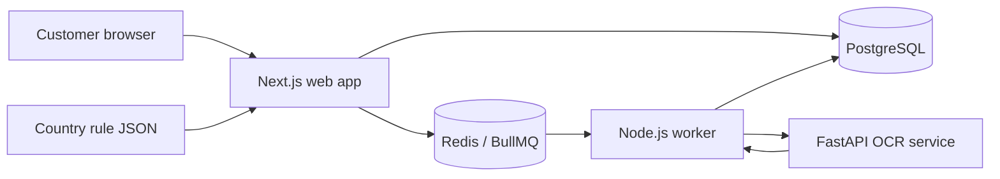

# Architecture

## Principles

- Keep the customer-facing product in one Next.js application until scale justifies another boundary.
- Keep OCR and document extraction isolated in Python; do not add general product logic to that service.
- Use Redis and BullMQ for retryable background work, not as a system of record.
- Store durable application state in PostgreSQL through the shared Prisma package.
- Keep shared packages small and dependency-light to avoid coupling applications together.

## Service map

The expected production upload path is browser to private object storage using a short-lived signed URL. Only an opaque storage key should enter the queue. The worker retrieves the document, calls the private OCR service, and persists normalized results through the database package. Object storage is intentionally not selected in this foundation.

## Workspace boundaries

| Path | Responsibility |
| --- | --- |
| `apps/web` | UI, server actions, route handlers, authentication boundary |
| `apps/worker` | BullMQ consumers, orchestration, retries, scheduled work |
| `apps/ocr-service` | File validation, OCR adapters, passport field extraction |
| `packages/database` | Prisma schema and process-safe client singleton |
| `packages/config` | Runtime environment validation |
| `packages/types` | Transport-neutral TypeScript contracts |
| `packages/ui` | Shared, shadcn/ui-ready React primitives |
| `shared/country-rules` | Versioned regulatory reference data |
| `shared/api-contracts` | Language-neutral HTTP contracts |

## Queue conventions

The initial queue is `passport-extraction`. Jobs should contain identifiers and storage keys, never raw document bytes or extracted personal data. Add deterministic job IDs for idempotency before enabling real extraction. Failed jobs should use bounded retries and a dead-letter review process.

## Evolution path

The next architectural step is an object-storage adapter plus the worker-to-OCR dispatch implementation. Authentication, organization tenancy, payments, and marketplace matching should be added as product requirements become concrete rather than guessed into this scaffold.
